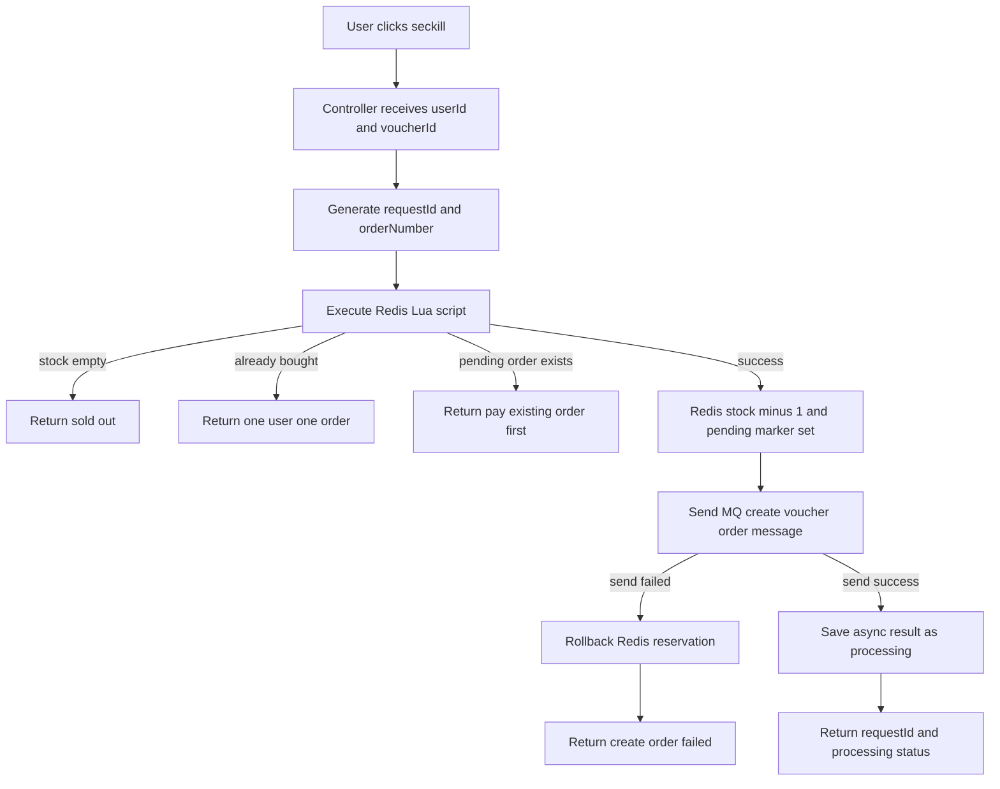
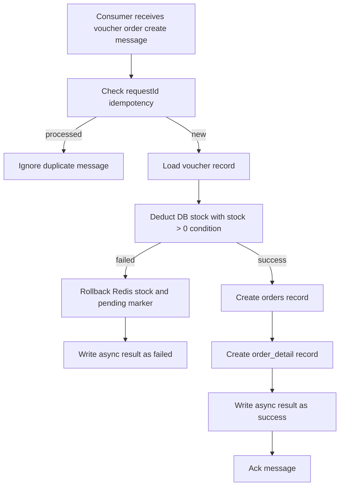
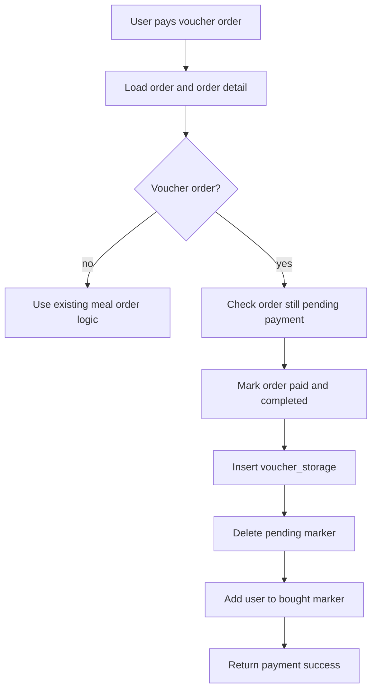
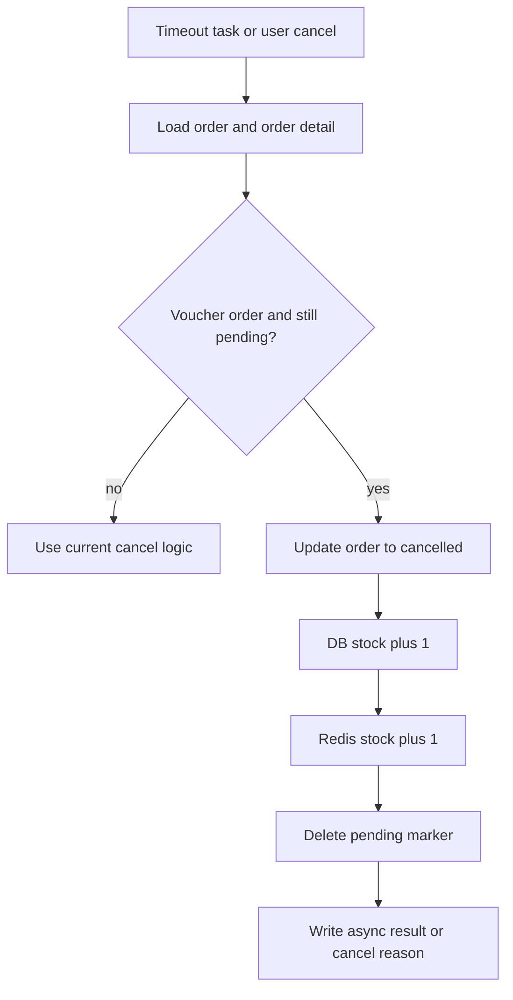

# Voucher Seckill Solution

## 1. Scope

This document refines the coupon seckill solution for the current `muscle-grow` monolith.

Current constraints:

- RabbitMQ is available and has passed local message send/receive validation.
- Redis is already connected in the project, but no Lua script based seckill logic exists yet.
- Current coupon purchase flow still creates the order synchronously in `UserVoucherServiceImpl`.
- Current stock deduction still happens after payment in `OrderServiceImpl`, which is not suitable for seckill traffic.

This solution keeps the system as a single Spring Boot service for now, and upgrades the coupon purchase path to:

- Redis atomic pre-check and reservation
- RabbitMQ async order creation
- MySQL conditional stock deduction as the final safety guard
- Payment success only completes the order and issues the coupon
- Timeout cancel and user cancel both release reserved stock

## 2. Business Rules

- One user can only hold one order for the same voucher at the same time.
- "One user one order" covers both:
  - already purchased vouchers
  - unpaid pending voucher orders
- If a pending voucher order is cancelled or timed out, the purchase qualification is released.
- Stock must never become negative.
- The final persistence result must be consistent across Redis, RabbitMQ, MySQL, `orders`, `order_detail`, and `voucher_storage`.
- Payment still uses the current mock flow. After successful payment, the voucher order goes directly to `COMPLETED`.

## 3. Target Architecture

### 3.1 Responsibility Split

- Redis:
  - atomic seckill eligibility check
  - pending reservation marker
  - pre-decrement cache stock
  - async result cache
  - consumer idempotency marker
- RabbitMQ:
  - traffic peak shaving
  - async order creation trigger
- MySQL:
  - final stock deduction
  - order persistence
  - order detail persistence
  - voucher ownership persistence after payment

### 3.2 Why the Current Flow Must Change

Current flow problems:

- Order creation is synchronous and performed directly in `UserVoucherServiceImpl`.
- Local `synchronized` only works in a single JVM instance.
- Voucher stock is deducted after payment, which allows too many unpaid orders to be created during high concurrency.

The new flow moves stock locking forward to the seckill stage.

## 4. Core Flow

### 4.1 Seckill Entry Flow

### 4.2 MQ Consumer Order Creation Flow

### 4.3 Payment Success Flow

### 4.4 Timeout Cancel or User Cancel Flow

## 5. State Definition

### 5.1 Order State

- Voucher order create success:
  - `status = PENDING_PAYMENT`
  - `payStatus = UN_PAID`
- Voucher payment success:
  - `status = COMPLETED`
  - `payStatus = PAID`
- Voucher timeout or cancel:
  - `status = CANCELLED`
  - `payStatus = UN_PAID`

### 5.2 Seckill Result State

Suggested async result state values:

- `PROCESSING`
- `SUCCESS`
- `FAILED`

## 6. Redis Key Design

| Key | Type | Meaning | TTL |
| --- | --- | --- | --- |
| `voucher:stock:{voucherId}` | string | cached seckill stock | no ttl |
| `voucher:pending:{voucherId}:{userId}` | string | user has one pending voucher order | 20 minutes |
| `voucher:bought:{voucherId}` | set | users who have successfully owned the voucher | no ttl |
| `voucher:result:{requestId}` | string/json | async order creation result | 30 minutes |
| `voucher:consume:{requestId}` | string | consumer idempotency marker | 1 day |
| `voucher:order:no:{yyyyMMdd}` | string | daily order number sequence | 2 days |

Notes:

- `pending` covers unpaid duplicate requests.
- `bought` covers already completed purchases.
- `result` is for front-end polling after async order creation.
- `consume` avoids duplicate MQ processing.
- `pending` ttl should be greater than the 15 minute order timeout, otherwise Redis may release the user a little earlier than the timeout task releases the DB order.

## 7. Redis Lua Script Responsibility

The Lua script should finish these checks atomically:

- validate voucher stock is greater than zero
- validate user is not already in `voucher:bought:{voucherId}`
- validate user does not already have `voucher:pending:{voucherId}:{userId}`
- decrement `voucher:stock:{voucherId}`
- set `voucher:pending:{voucherId}:{userId}` with a 20 minute ttl

Recommended return codes:

- `0`: success
- `1`: sold out
- `2`: already bought
- `3`: pending order exists

## 8. MQ Design

### 8.1 Exchange and Queue

Current available topology:

- exchange: `voucher.order.exchange`
- queue: `voucher.order.create.queue`
- routing key: `voucher.order.create`

### 8.2 Message Body

Message fields should include:

- `requestId`
- `userId`
- `voucherId`
- `orderNumber`
- `payAmount`
- `requestTime`

Optional fields:

- `userName`
- `traceId`

## 9. Database Strategy

### 9.1 Order Creation

Consumer creates:

- one `orders` row
- one `order_detail` row with `voucherId`

### 9.2 Final Stock Safety Guard

Database stock update must still use conditional SQL:

- `update voucher set stock = stock - 1 where id = ? and stock > 0 ...`

This keeps the DB as the final anti-oversell guard even if Redis data becomes inconsistent.

### 9.3 Payment Completion

After payment:

- insert into `voucher_storage`
- do not deduct stock again

### 9.4 Recommended Database Constraints

To make the final result resistant to duplicate messages and retry edge cases, add these database constraints before full rollout:

- unique index on `orders.number`
- unique index on `voucher_storage(user_id, voucher_id)`

These indexes are the final hard guard for:

- duplicate order number insertion
- duplicate voucher ownership insertion

## 10. Idempotency Design

### 10.1 Request Side

Use `requestId` to identify one seckill request.

### 10.2 Consumer Side

Consumer checks `voucher:consume:{requestId}` before processing:

- if exists, skip duplicate message
- if not exists, process and set marker after transaction success

### 10.3 Order Number

The project currently has no reusable distributed order number generator. Add one small dedicated component for voucher order numbers.

Recommended format:

- `VO` + `yyyyMMddHHmmss` + 6 digit sequence

Example:

- `VO20260321170512000031`

## 11. Compensation Strategy

### 11.1 MQ Send Failure

If Redis reservation succeeds but MQ send fails:

- increment `voucher:stock:{voucherId}`
- delete `voucher:pending:{voucherId}:{userId}`
- write failed result

### 11.2 Consumer DB Failure

If MQ consumption starts but DB stock deduction or order insert fails:

- increment Redis stock
- delete pending marker
- write failed result

### 11.3 Timeout Cancel

If pending voucher order times out:

- update order to cancelled
- increment DB stock
- increment Redis stock
- delete pending marker

## 12. API Adjustment

Recommended user APIs:

- `GET /user/voucher/list`
- `POST /user/voucher/seckill/{id}`
- `GET /user/voucher/seckill/result/{requestId}`

Compatibility recommendation:

- keep current `POST /user/voucher/purchase/{id}` temporarily during transition
- switch the front-end to the new async seckill API after back-end is ready
- remove or internally redirect the old endpoint in the final cleanup stage

## 13. Implementation Principles

- Do not split into microservices in this phase.
- Do not refactor all existing order code at once.
- First isolate voucher seckill order logic from normal meal order logic.
- Keep current mock payment logic.
- Add tests for Redis script, MQ consumer, timeout rollback, and payment completion.
- Synchronize Redis stock when vouchers are created, updated, started, stopped, or manually adjusted by the admin side.

## 14. Deliverables

The first implementation milestone should achieve:

- voucher seckill request can be accepted under high concurrency
- duplicate purchase request is blocked before hitting MySQL
- oversell is prevented by Redis plus DB double guard
- payment success issues voucher correctly
- timeout cancel releases stock correctly
- front-end can poll async seckill result and continue payment
